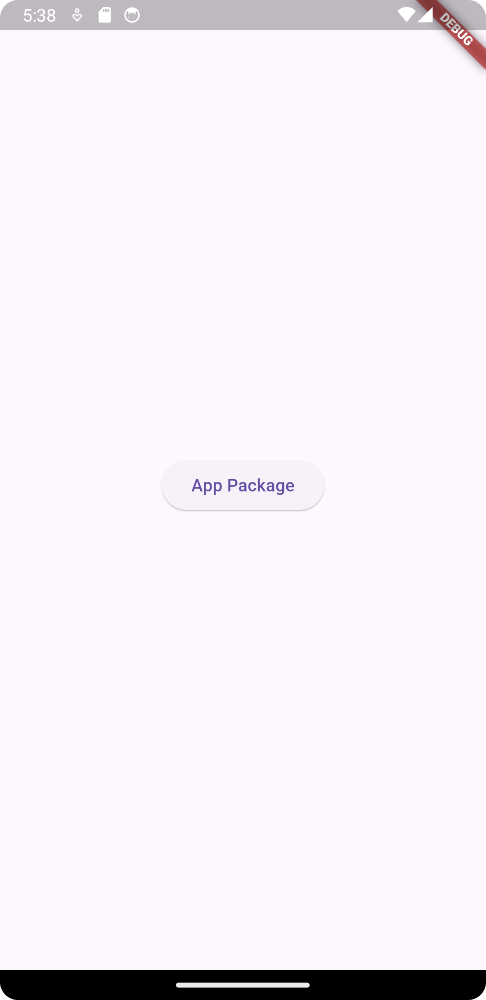
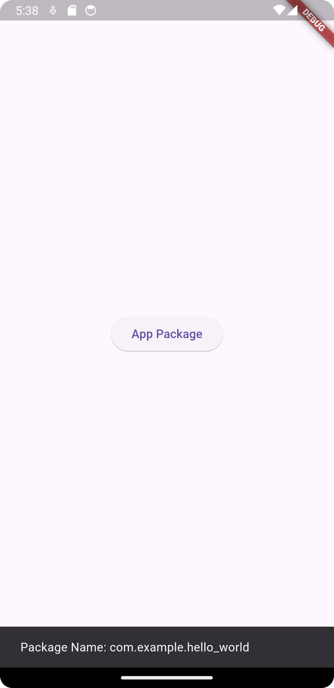

To get the package name of a Flutter app, you can do the following:

### 1. **Android (Gradle Configurations)**:
The app's package name is defined in the `AndroidManifest.xml` file under the `<manifest>` tag with the `package` attribute.

- Open `android/app/src/main/AndroidManifest.xml` in your Flutter project.
- Look for the `package` attribute at the top:

```xml
<manifest xmlns:android="http://schemas.android.com/apk/res/android"
    package="com.example.yourapp">
    <!-- other configurations -->
</manifest>
```

The value of the `package` attribute (`com.example.yourapp`) is your app's package name.

### 2. **iOS**:
For iOS, the equivalent of the Android package name is the **bundle identifier**, which can be found in the `ios/Runner.xcodeproj/project.pbxproj` file:

1. Open `ios/Runner.xcodeproj` in Xcode.
2. Navigate to the **General** tab of the project.
3. Look for the **Bundle Identifier** field. This is your iOS app identifier, typically in the format `com.example.yourapp`.

### 3. **Programmatically in Flutter**:
If you need to retrieve the package name dynamically in your Flutter app, you can use the `package_info_plus` package:

1. Add the `package_info_plus` dependency in your `pubspec.yaml`:

   ```yaml
   dependencies:
     package_info_plus: ^4.0.0
   ```

2. Use the following code to get the package name:

   ```dart
   import 'package:package_info_plus/package_info_plus.dart';

   Future<void> getAppPackageName() async {
     PackageInfo packageInfo = await PackageInfo.fromPlatform();

     String packageName = packageInfo.packageName;
     print("Package Name: $packageName");
   }
   ```

This will return the package name of your app, which you can use in various parts of your app as needed.

```dart
import 'package:flutter/material.dart';
import 'package:hello_world/screens/HomeScreen.dart';

void main() {
  runApp(const MyApp());
}

class MyApp extends StatelessWidget {
  const MyApp({super.key});

  @override
  Widget build(BuildContext context) {
    return MaterialApp(
      home: HomeScreen(),
    );
  }
}
```

```dart
import 'package:flutter/material.dart';

import 'package:package_info_plus/package_info_plus.dart';

Future<void> getAppPackageName(BuildContext context) async {
  PackageInfo packageInfo = await PackageInfo.fromPlatform();

  String packageName = packageInfo.packageName;

  print("Package Name: $packageName");

  ScaffoldMessenger.of(context).showSnackBar(
    SnackBar(content: Text("Package Name: $packageName"))
  );

}

class HomeScreen extends StatelessWidget {
  const HomeScreen({super.key});

  @override
  Widget build(BuildContext context) {
    return Scaffold(
      body: Center(
        child: ElevatedButton(
            onPressed: (){
              getAppPackageName(context);
            },
            child: Text('App Package')
        ),
      ),
    );
  }
}
```


