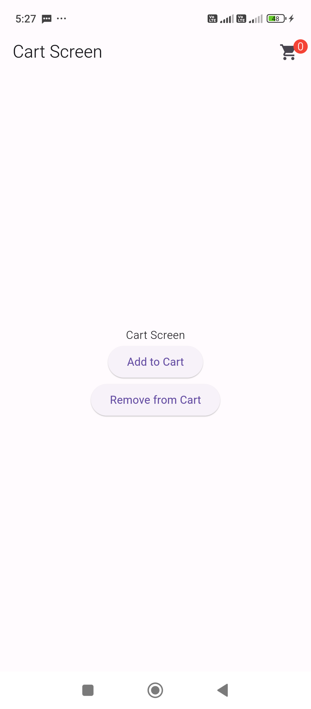
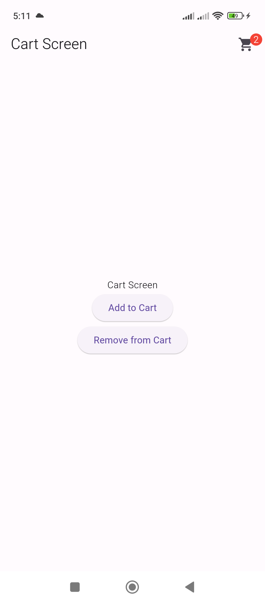

To implement a badge for a cart screen using the `badges` package in Flutter, you can show a badge on the cart icon indicating the number of items in the cart. Here's a simple example:

```
https://pub.dev/packages/badges
```

1. First, add the `badges` package to your `pubspec.yaml`:

```yaml
dependencies:
  badges: ^3.1.1
```

2. After that, you can create a cart screen with a badge on the cart icon like this:

```dart
import 'package:flutter/material.dart';
import 'package:untitled/screens/CartScreen.dart';

void main() {
  runApp(MyApp());
}

class MyApp extends StatelessWidget {
  @override
  Widget build(BuildContext context) {
    return MaterialApp(
      home: CartScreen(),
    );
  }
}
```


```dart
import 'package:flutter/material.dart';
import 'package:badges/badges.dart' as badges; // Prefixing the badges package

class CartScreen extends StatefulWidget {
  @override
  _CartScreenState createState() => _CartScreenState();
}

class _CartScreenState extends State<CartScreen> {
  int _cartItemCount = 0; // Example count

  @override
  Widget build(BuildContext context) {
    return Scaffold(
      appBar: AppBar(
        title: Text("Cart Screen"),
        actions: [
          Padding(
            padding: const EdgeInsets.only(right: 16),
            child: badges.Badge( // Using badges.Badge
              position: badges.BadgePosition.topEnd(top: -10, end: -12),
              badgeContent: Text(
                _cartItemCount.toString(),
                style: TextStyle(color: Colors.white),
              ),
              badgeStyle: badges.BadgeStyle( // Using badges.BadgeStyle
                badgeColor: Colors.red,
              ),
              child: Icon(Icons.shopping_cart),
            ),
          ),
        ],
      ),
      body: Center(
        child: Column(
          mainAxisAlignment: MainAxisAlignment.center,
          children: [
            Text('Cart Screen'),
            ElevatedButton(
              onPressed: () {
                setState(() {
                  _cartItemCount++; // Example of adding items to the cart
                });
              },
              child: Text('Add to Cart'),
            ),
            ElevatedButton(
              onPressed: () {
                setState(() {
                  _cartItemCount--; // Example of adding items to the cart
                });
              },
              child: Text('Remove from Cart'),
            ),
          ],
        ),
      ),
    );
  }
}
```

### Explanation:
- The `Badge` widget wraps around the cart icon and displays the current number of items in the cart.
- The `badgeContent` shows the item count.
- The `badgeColor` is set to red to make the badge visible.
- The `position` helps to align the badge to the top-right of the cart icon.

This example includes a button to simulate adding items to the cart, updating the badge count dynamically.



